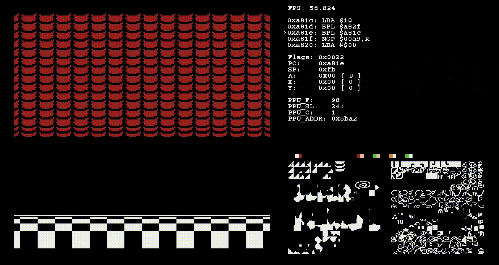

# borzNES

Yet another NES emulator, written just for fun :)

Cross-platform (Linux, MacOS, Windows) and with **online multiplayer** support!



# Build
## Build (Linux/MacOS)

Install SDL2 and SDL2_ttf and build using cmake:
```
$ mkdir build
$ cd build
$ cmake -DCMAKE_BUILD_TYPE=Release ../src
$ make
```

To enable the Debug "GameView" (showing CPU/PPU state info and enabling single-step mode), use:
```
-DENABLE_DEBUG_GW=on
```

Tested on MacOS and Ubuntu.

## Build (Windows with MinGW)

Install MinGW.

Download SDL2 and SDL2_ttf for MinGW and copy the content of both folders (merging them) in `/path/to/MinGW/SDL2`.

Run:
```
$ mkdir build_win
$ cmake -DWIN=on -DWIN_SDL2=/path/to/MinGW/SDL2 -DCMAKE_BUILD_TYPE=Release ../src
$ make
```

# Usage
## Single Player

From the build directory:

```
$ ./borznes /path/to/rom
```

beware that it expects "courier.ttf" in the pwd (yeah, it's ugly).

## Multiplayer

On Machine 1:
```
$ ./borznes_multi /path/to/rom
```

The program will wait for a connection on port 54000.

On Machine 2:
```
$ ./borznes_multi /path/to/rom 10.0.0.1
```

where `10.0.0.1` is the IP of Machine1.

# Keymappings

The (hardcoded) keymappings for Player1 are the following:

| action                           | key        | note                         |
|----------------------------------|------------|------------------------------|
| A                                | Z          |                              |
| B                                | X          |                              |
| Start                            | Enter      |                              |
| Select                           | RightShift |                              |
| Up/Down/Left/Right               | ArrowKeys  |                              |
| Save State                       | F1         | not available in multiplayer |
| Load State                       | F2         | not available in multiplayer |
| Fast Forward Mode (2x CPU speed) | F          | not available in multiplayer |
| Slow Mode (0.5x CPU speed)       | G          | not available in multiplayer |
| Rewind (hold)                    | R          | not available in multiplayer |
| Enter Debug Mode (if enabled)    | D          | not available in multiplayer |
| (in Debug mode) step CPU         | I          | not available in multiplayer |
| (in Debug mode) step PPU frame   | O          | not available in multiplayer |
| Mute                             | M          |                              |
| Quit                             | Q          |                              |

# Implemented Mappers

NROM(000), MMC1(001), NROM(003), MMC3(004), AxROM(007), Camerica(071)

# Todo
- Controller support
- Config file for keymappings and other stuff
- Check that P1 and P2 are running the same ROM (P1 should send an hash of its ROM)
- Support state saving in multiplayer (it should be easy, P1 should send a state to P2 via socket)
- More mappers

# Credits

- Highly inspired by https://github.com/fogleman/nes
- Series on developing a NES emulator in C++ by "javidx9" (OneLoneCoder): https://www.youtube.com/playlist?list=PLrOv9FMX8xJHqMvSGB_9G9nZZ_4IgteYf
- Series on developing a NES emulator in C++ by "Systems with JT": https://www.youtube.com/playlist?list=PLP2yfE2-FXdQBRpnZbcObTe33-eSeSRYl
- NesDEV wiki: https://www.nesdev.org/wiki/Nesdev_Wiki
- Accurate description of the first 90 mappers: https://www.romhacking.net/documents/362/
